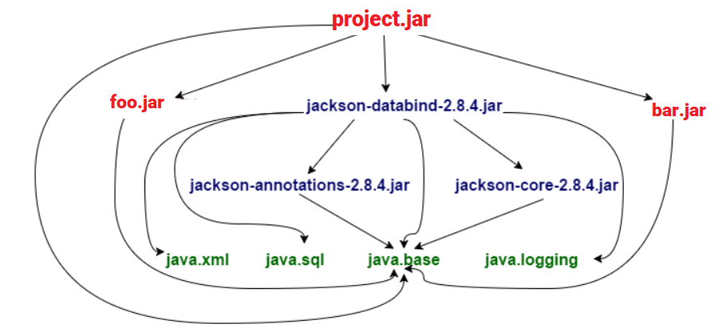

# Java 9 simple multi-module project
Sample created to understand the module support introduced by Java 9.
Basically is possible define modules inside the application that can:
- import modules
- export specific packages

Each module declare what need to include or what want to share with other modules defining the ```module-info.java```.
Below an example:

```java
//bootstrap module require to import a specific package to use
module bootstrap {
  requires andzac.greetings;
}

//greetings module export a single package externally
  module andzac.greetings {
      exports it.andzac.j9;
  }
```
> The module-info should be defined at src folder level.
## Example
The demo application is defined with two module:
- ```greetings``` that export the package that contains the ```Greetings``` class
- ```bootstrap``` that require the ```Greetings``` class to use its method.

# Migration to Java 9 multimodule
As example let's assume that our java application is composed by three component: the main project plus two custom jar modules integrated in the application classpath.
The following image summarize the example:



In order to migrate to multi module Java 9 structure there are two different approches:

- *bottom-up* migration
- *top-down* migration

## Bottom-up migration
The idea is to modularize starting from the leaf of the dependencies tree.
- Java dependencies (```java.xml```, ```java.sql```, ```java.base```, ```java.logging```) are already modularized
- ```foo.jar``` can be modularized in ```foo module```
- ```bar.jar``` can be modularzed in ```bar module```
- The Jackson jar cannot be modularized because is 3rd party library.
- ```project.jar``` cannot be modularized because rely on not modularized libraries

>Moving the jackson dependencies in a unnamed module can address a fully modularized application because in this way also project can be modularized.

## Top-down migration
The idea here is to start to modularize the main project, moving everything else in a unnamed automatic module created by the JVM.
After that we can go through the big unnamed module and extract from there what can be defined as an indipendent module.